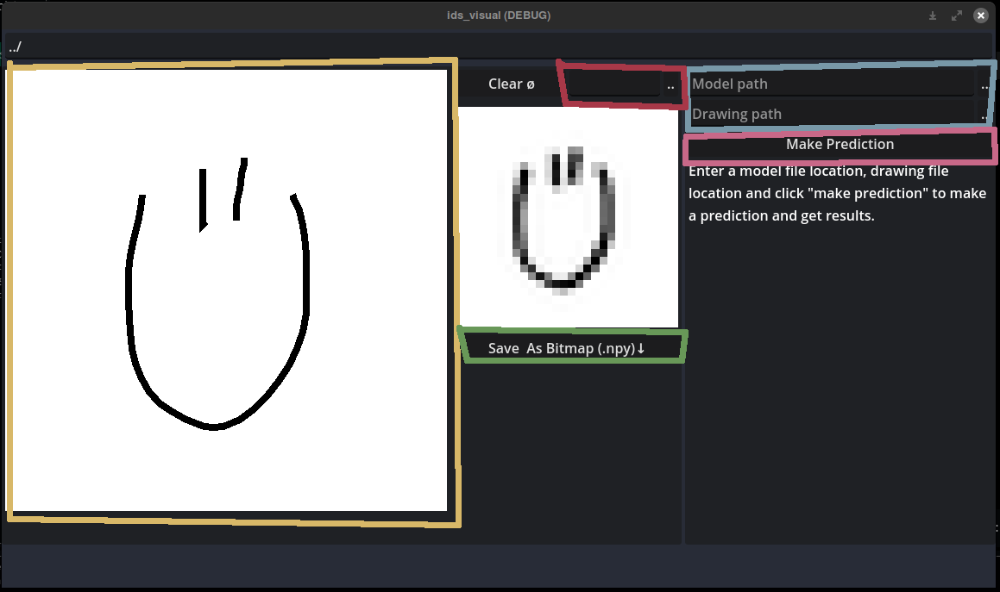

# IDS-Quickdraw-Analysis

Authors: Rasmus Lille, Aksel Martin Muru

## Goals
With this project we wanted to
train a model that could name
objects from input doodles. This was made possible by the public
Google Quick! Draw dataset that is publicly available at
https://github.com/googlecreativelab/quickdraw-dataset/.
We set a goal of 75% accuracy with
the predicted object types.

## How to Use
### Dependencies

- Python >=3.10
- Tensorflow
- Keras
- Numpy
- Scikit-Learn
- Matplotlib
- Optional: Godot 4.3
- Optional: Node (to download the data files from Google Cloud, you can use any other method to do that)

### CNN Model
**Downloading data**

One option is to run `./scripts/download_data.js` using Node to download all of the data files from the Google dataset. By default it downloads all numpy array drawing files into `./data/numpy_bitmap/`. You can edit the file if you need to download datasets processed in other ways. Check the [Quick! Draw](https://console.cloud.google.com/storage/browser/quickdraw_dataset) dataset storage on Google Cloud to check the paths if you need. On the [dataset page](https://github.com/googlecreativelab/quickdraw-dataset/) you can find links to other methods of downloading the data as well. 

**Using the Python script in `models/cnn/cnn.py`:**

With no arguments, it saves a new CNN using options in `models/cnn/config.py` to `saved.keras` (in whichever directory you ran the script in).

Pass in a filename using `--filename` to test a numpy bitmap 2d array as an image and get prediction results. It is recommended to also **pass in a model file path** (filename ending with `.keras`) using `--modelfile` so the script will load a model from there instead of training a new one. A suitable file to pass in as a drawing is for example a drawing from the dataset, or one generated with the Godot app.

Example: `python3 ./models/cnn/config.py --filename ./drawings/angel.npy --modelname ./saved.keras`

(You need Python, TensorFlow, Keras, Numpy, and others installed to do anything)

You can edit `models/cnn/config.py` to change some settings regarding training models.

**Using the Godot application**

1. Download [Godot](https://www.godotengine.org) and launch it (4.3 is required)
2. Import `./godot` as a project
3. Run with F5

The Godot project can help create drawings in the numpy array file format, and can also display prediction results when you specify filepaths for the model and drawing files. Under the hood, it calls the script cnn.py and specifies the model and drawing file names, so your system **needs to have `python3` in its `PATH`**.

The drawing pad is outlined in yellow, you can draw on it with your mouse. To save the image to a file, use the box outlined in red.

To predict drawing classes, provide a drawing path and a model path (outlined in blue). The model will be loaded in along with the drawing and the three most probable class predictions will be displayed when you press the Make Prediction button (outlined in pink).

## Repository Contents
### Scripts
Scripts to download data, parse NDJSON files.

### Models/CNN
Files regarding the convolutional neural network (Python scripts + trained saved models (.keras files))

### Godot
Files regarding the Godot app for visually creating and saving drawing files and predictions.

### Other
Jupyter Notebook files are used for testing by us so they are not meant to be in presentable quality.
